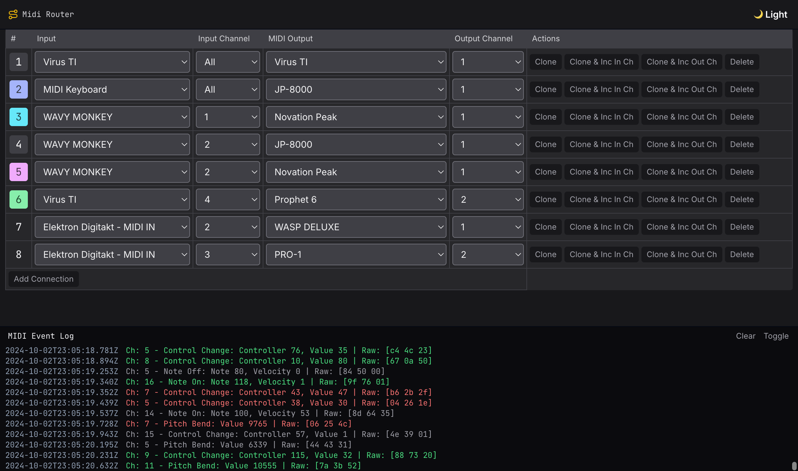

# 🎹↯ MIDI Router


MIDI Router is a web-based application that allows you to route MIDI messages between different input and output
devices. It's perfect for musicians, producers, and anyone working with MIDI-enabled hardware or software.

## Features

- 🎹 Connect multiple MIDI inputs to multiple MIDI outputs
- 🎛️ Channel-specific routing
- 🌓 Dark mode support
- 📊 Real-time MIDI event logging
- 💾 Automatic saving of routing configurations

## Demo

[View Live Demo](https://https://midi-router.vercel.app/)



## Getting Started

### Prerequisites

- A web browser that supports the Web MIDI API (e.g., Chrome, Edge)
- MIDI devices (input and/or output)

### Hosted Version

The application is hosted on Vercel. You can access it at the following URL:

> 🔗 [https://midi-router.vercel.app/](https://midi-router.vercel.app/)

### Installation - Local Development

1. Clone the repository:

   ```
   git clone https://github.com/HelgeSverre/midi-router.git
   ```

2. Navigate to the project directory:

   ```
   cd midi-router
   ```

3. Open `index.html` in your web browser.

## Usage

1. Connect your MIDI devices to your computer.
2. Open the MIDI Router application in your web browser.
3. Grant MIDI access when prompted by the browser.
4. Use the interface to create routing configurations:
   - Select input devices and channels
   - Choose output devices and channels
   - Add or remove routing connections as needed
5. The application will automatically save your configurations for future use.

## Development

This project uses:

- [Alpine.js](https://alpinejs.dev/) for reactive JavaScript
- [Tailwind CSS](https://tailwindcss.com/) for styling

To modify the project:

1. Edit the HTML, CSS, and JavaScript in `index.html`.
2. If you're changing Tailwind classes, you may need to rebuild the CSS. Refer to
   the [Tailwind CSS documentation](https://tailwindcss.com/docs/installation) for more information.

## Contributing

Contributions are welcome! Please feel free to submit a Pull Request.

## License

This project is licensed under the MIT License - see the [LICENSE](LICENSE) file for details.
